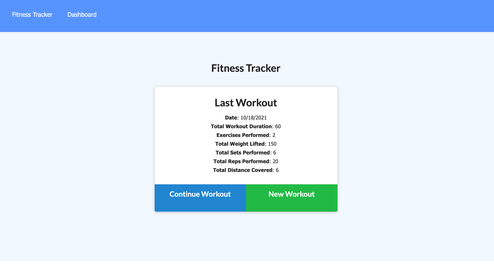
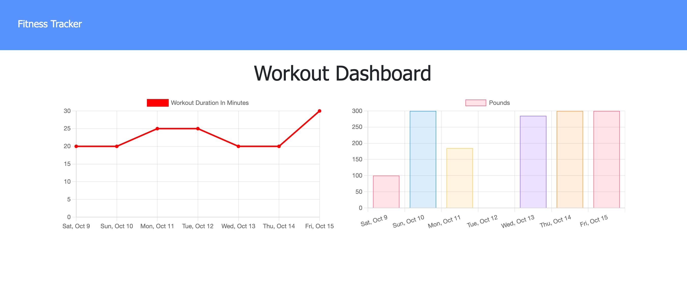

# WorkOut-Track
A simple workout website that enables the user to view create and track daily workouts. 

# Motivation for this project

Create a workout tracker that allows the user to view create and track daily workouts. Have the ability to log multiple exercises in a workout on a given day, track the name, type, weight, sets, reps, and duration of exercise and if the exercise is a cardio exercise, the user is able to track the distance they traveled.

# Reason for this project 

Create and deploy full-stack workout tracker application. Using Mongo database with a Mongoose schema and handle routes with Express. 

# What I learned from this project 

In this activity I learnt:

* The step by step breaking down method of the acceptance criteria on HW assignment and the importance of commenting especially after the code has been erased and you cannot remember what was on the code line previously.

* How to use both a GUI and the Mongo command prompt to interface with a database.

* The importance of stackoverflow when trying to figure out what the inspect mistake made means/wants you to correct what you need fixed. 

* How to create query builders to populate documents using refs. 

* How to integrate Mongoose in a full-stack web application.

# Website

# Contact 

* Name: Consolata Njeri
* Email: Conso4u@gmail.com
